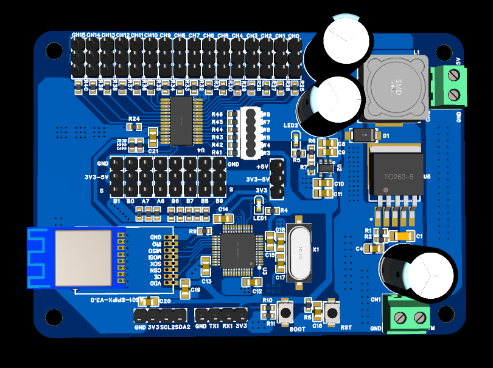

# 并联臂四足

#### 硬件设计
    单片机：STM32F103C8T6
    电源方案：7.4V-12V输入，通过XL4005E1输出5V给舵机供电，再通过RT9013输出3.3V给单片机供电
    通信：NRF24L01
    舵机驱动：方案一：直接通过2个定时器产生8路PWM输出；方案二：通过IIC与PCA9685通信，驱动舵机
#### 软件架构
1.产生摆线方程，生成足端轨迹规划
    sigma=2pi(t-t_T)/(faaiTs);
    Xep=((xf-xs)(sigma-(sin(sigma))))/(2pi)+xs;
    Zep=h(1-cos(sigma))/2;

2.运动学逆解（余弦定理、勾股定理）

A、B分别为两个舵机输出轴心，它们相距距离为2a。足端坐标（x,y）由轨迹规划而来。L1，L2为腿部的上臂和下臂臂长。
θ1和θ2才是我们需要求解的舵机转动角度。
而θ1=90°-（β-γ），所以求解顺序为：L3→β→γ

3.用MPU6050传感器反馈数据来实现姿态控制

#### 注意事项

1.  组装舵机前，先下载舵机回中位的程序，即将 main.c中的这部分注释掉，如图

2.  注意舵机引脚分配：FR-前→A6，FR-后→A7;BR-前→B0,BR-后→B1;BL-前→B8,BL-后→B9;FL-前→B6,FL-后→B7

#### 展示

